# serverless-certs-and-secrets

# Table of Contents

* [Requirements](#Requirements)
* [Add a TLS/SSL certificate in Azure Function Code](#Add-a-TLS/SSL-certificate-in-Azure-Function-Code)
* [Add a TLS/SSL certificate in Azure Function (App Service) as endpoint](#Add-a-TLS/SSL-certificate-in-Azure-App-Service-(Azure-Function)-as-endpoint)
    - [Prerequisites](#Prerequisites)
    - [Using a free certificate (Preview)](#Using-a-free-certificate-(Preview))
    - [Import an App Service Certificate](#Import-an-App-Service-Certificate)
        - [Start certificate order](#Start-certificate-order)
        - [Store in Azure Key Vault](#Store-in-Azure-Key-Vault)
        - [Verify domain ownership](#Verify-domain-ownership)
        - [Import certificate into App Service](#Import-certificate-into-App-Service)
    - [Import a certificate from Key Vault](#Import-certificate-from-Key-Vault)
        - [Authorize App Service to read from the vault](#Authorize-App-Service-to-read-from-the-vault)
        - [Import a certificate from your vault to your app](#Import-certificate-from-your-vault-to-your-app)
    - [Upload a private certificate](#Upload-private-certificate)
        - [Merge intermediate certificates](#Merge-intermediate-certificates)
        - [Export certificate to PFX](#Export-certificate-to-PFX)
        - [Upload certificate to App Service](#Upload-certificate-to-App-Service)
    - [Considerations](#Considerations)
* [Todo List](#Todo-List)
* [Work Progress](#Work-Progress)


# Requirements

1. What certificate a function app used to connect to other services?
    - Demonstrate and document how to upload the public certificate to the code and test the access to some azure service

2. What certificate a function app should use to provide an endpoint ?
    - Demonstrate and document the best way to add certificate to a function app as a endpoint. Available options are:
        - Create a free App Service Managed Certificate (Preview)
        - Purchase an App Service certificate
        - Import a certificate from Key Vault
        - Upload a private certificate


# Add a TLS/SSL certificate in Azure Function Code


- First of all, in this example, we'll use a self sign certificate. But in a production environment its strongly recommended to use

- Let's create a functionApp in Azure. It will be our Certificate Requester

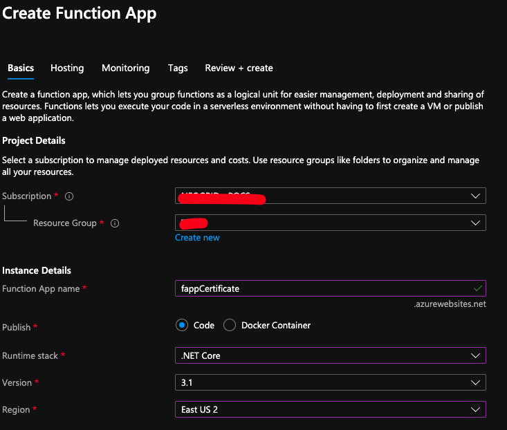

1. In this example we're using a Basic B1 for ASP. This is just for demo.

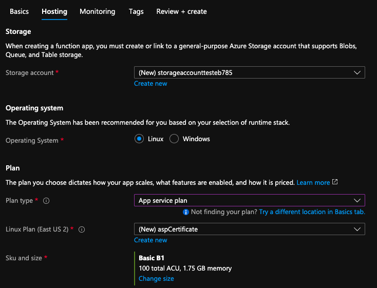

2. At this moment you dont see any functions. We need to upload our first one.

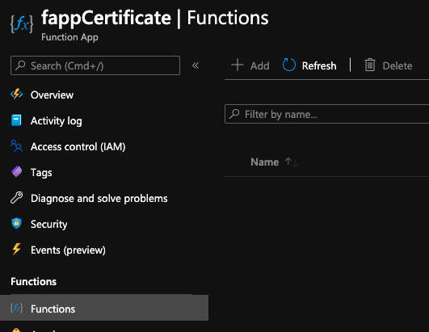


3. Before that, we need to have a .pfx certificate to use in our code. In this example we are using a self cert. In the folder `FunctionCertificates/CreateSelfSignedCertificateConsole` there is a self certificate generator, all you have to do is edit the `Program.cs` providing the corrent certificate infos and run the code. But, if you have a certificate already you can use it.

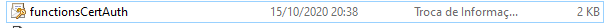

4. Before upload the code, we'll need to copy the required certificate thumbprint and paste in our function code. Edit `/FunctionCertificates/FunctionCertificate/RandomStringFunction.cs` and paste the certificate thumbprint into the code.

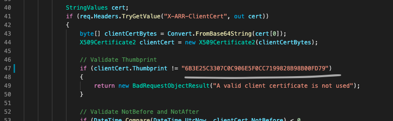

4. In this example we're using VSCode with Azure Function extension to upload the functions. Upload the function to your functionapp in azure clicking with right button in the explorer area and selecting the appropriate functionapp.

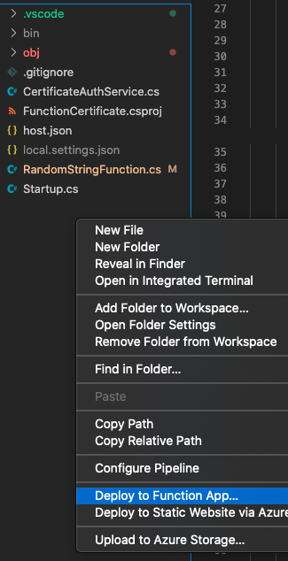

5. Now we can see our function in the functionapp.

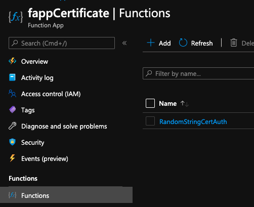


6. In your functionApp, you will need to restrict the access only with certificate. Go to Setting -> Configuration -> Incoming client certificates and select to "require"


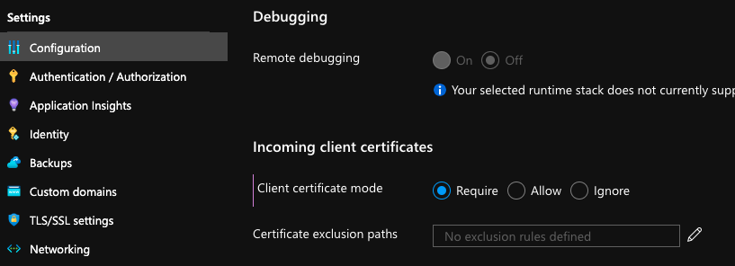


7. Now we're ready to use certificate. Let's create another FunctionApp with another Azure Service plan. Repeat the steps 1 and 2. In this example we named the functionapp as `fappCertificateClient`. At the end well have a resource group same as image below.

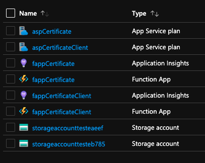


8. Copy the certificate .pfx and put in `/FunctionCertificates/FunctionCertificateConsoleClient/` folder. Now you need to edit the `Program.cs` file and change the location of the certificate and the password, and the url for the functionapp certificate. Also, edit the `FunctionCertificateConsoleClient.csproj` to make sure that the certificate will be upload to your functionApp.

- Program.cs

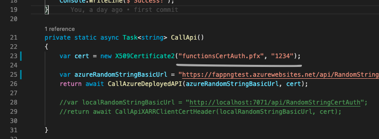

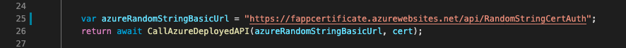

- FunctionCertificateConsoleClient.csproj

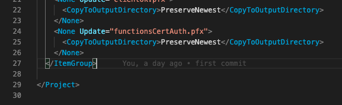


9. Upload this function to the new functionAppClient.


10. Access your functionClient using browser. E.g: https://fappcertificateclient.azurewebsites.net/api/RandomStringCertAuthClient. If everything is alright you'll see a encoded string as response body. this response is returned from your first functionApp.

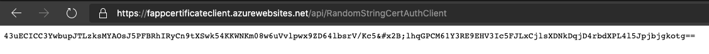


# Add a TLS/SSL certificate in Azure Function (App Service) as endpoint

The following table lists the options you have for adding certificates in App Service:

|Option|Description|
|-|-|
| Create a free App Service Managed Certificate (Preview) | A private certificate that's easy to use if you just need to secure your `www` [custom domain](app-service-web-tutorial-custom-domain.md) or any non-naked domain in App Service. |
| Purchase an App Service certificate | A private certificate that's managed by Azure. It combines the simplicity of automated certificate management and the flexibility of renewal and export options. |
| Import a certificate from Key Vault | Useful if you use Azure Key Vault to manage your [PKCS12 certificates](https://wikipedia.org/wiki/PKCS_12). See [Private certificate requirements](#private-certificate-requirements). |
| Upload a private certificate | If you already have a private certificate from a third-party provider, you can upload it. See [Private certificate requirements](#private-certificate-requirements). |


## Prerequisites

To follow this how-to guide:

- You need to have a Function running in a App service. Consumption mode will not work.
- Free certificate only: map a subdomain (for example, `www.contoso.com`) to App Service with a [CNAME record](app-service-web-tutorial-custom-domain.md#map-a-cname-record).


## Private certificate requirements

> [!NOTE]
> Azure Web Apps does **not** support AES256 and all pfx files should be encrypted with TripleDES.

The [free App Service Managed Certificate](#create-a-free-certificate-preview) or the [App Service certificate](#import-an-app-service-certificate) already satisfy the requirements of App Service. If you choose to upload or import a private certificate to App Service, your certificate must meet the following requirements:

* Exported as a [password-protected PFX file](https://en.wikipedia.org/w/index.php?title=X.509&section=4#Certificate_filename_extensions)
* Contains private key at least 2048 bits long
* Contains all intermediate certificates in the certificate chain

To secure a custom domain in a TLS binding, the certificate has additional requirements:

* Contains an [Extended Key Usage](https://en.wikipedia.org/w/index.php?title=X.509&section=4#Extensions_informing_a_specific_usage_of_a_certificate) for server authentication (OID = 1.3.6.1.5.5.7.3.1)
* Signed by a trusted certificate authority

> [!NOTE]
> **Elliptic Curve Cryptography (ECC) certificates** can work with App Service but are not covered by this article. Work with your certificate authority on the exact steps to create ECC certificates.


## Create a free certificate (Preview)

The free App Service Managed Certificate is a turn-key solution for securing your custom DNS name in App Service. It's a fully functional TLS/SSL certificate that's managed by App Service and renewed automatically. The free certificate comes with the following limitations:

- Does not support wildcard certificates.
- Does not support naked domains.
- Is not exportable.
- Is not supported on App Service Environment (ASE)
- Does not support A records. For example, automatic renewal doesn't work with A records.

> [!NOTE]
> The free certificate is issued by DigiCert. For some top-level domains, you must explicitly allow DigiCert as a certificate issuer by creating a [CAA domain record](https://wikipedia.org/wiki/DNS_Certification_Authority_Authorization) with the value: `0 issue digicert.com`.
>

To create a free App Service Managed Certificate:

In the <a href="https://portal.azure.com" target="_blank">Azure portal</a>, from the left menu, select **App Services** > **\<app-name>**.

From the left navigation of your app, select **TLS/SSL settings** > **Private Key Certificates (.pfx)** > **Create App Service Managed Certificate**.

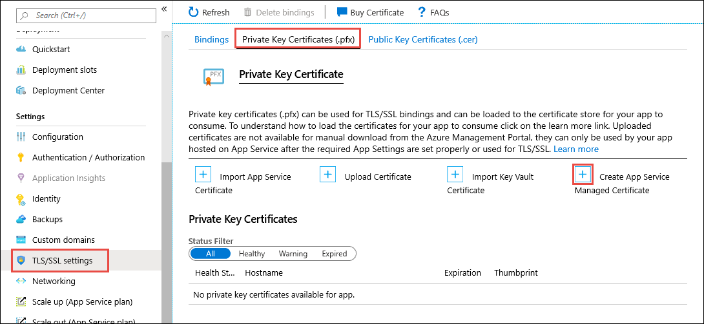

Any non-naked domain that's properly mapped to your app with a CNAME record is listed in the dialog. Select the custom domain to create a free certificate for and select **Create**. You can create only one certificate for each supported custom domain.

When the operation completes, you see the certificate in the **Private Key Certificates** list.

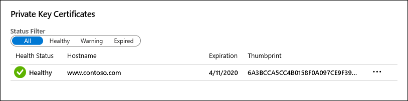

> [!IMPORTANT]
> To secure a custom domain with this certificate, you still need to create a certificate binding. Follow the steps in [Create binding](configure-ssl-bindings.md#create-binding).
>


## Import an App Service Certificate

If you purchase an App Service Certificate from Azure, Azure manages the following tasks:

- Takes care of the purchase process from GoDaddy.
- Performs domain verification of the certificate.
- Maintains the certificate in Azure Key Vault.
- Manages certificate renewal (see [Renew certificate](#renew-certificate)).
- Synchronize the certificate automatically with the imported copies in App Service apps.

To purchase an App Service certificate, go to [Start certificate order](#start-certificate-order).

If you already have a working App Service certificate, you can:

- [Import the certificate into App Service](#import-certificate-into-app-service).
- [Manage the certificate](#manage-app-service-certificates), such as renew, rekey, and export it.


### Start certificate order

Start an App Service certificate order in the <a href="https://portal.azure.com/#create/Microsoft.SSL" target="_blank">App Service Certificate create page</a>.

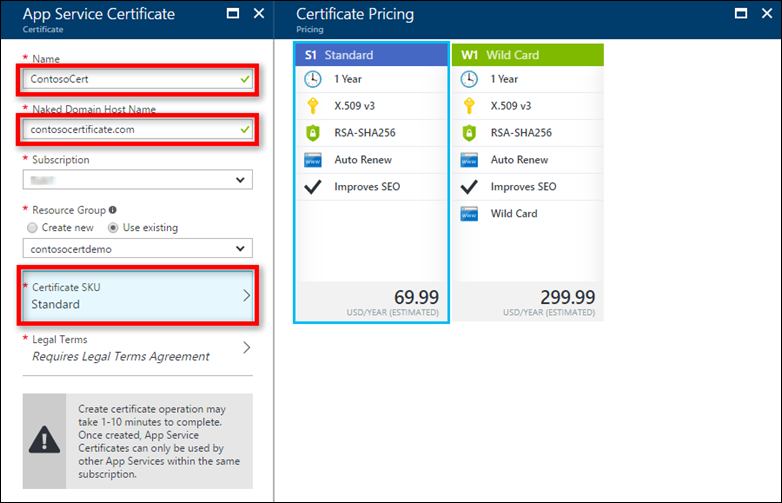

Use the following table to help you configure the certificate. When finished, click **Create**.

| Setting | Description |
|-|-|
| Name | A friendly name for your App Service certificate. |
| Naked Domain Host Name | Specify the root domain here. The issued certificate secures *both* the root domain and the `www` subdomain. In the issued certificate, the Common Name field contains the root domain, and the Subject Alternative Name field contains the `www` domain. To secure any subdomain only, specify the fully qualified domain name of the subdomain here (for example, `mysubdomain.contoso.com`).|
| Subscription | The subscription that will contain the certificate. |
| Resource group | The resource group that will contain the certificate. You can use a new resource group or select the same resource group as your App Service app, for example. |
| Certificate SKU | Determines the type of certificate to create, whether a standard certificate or a [wildcard certificate](https://wikipedia.org/wiki/Wildcard_certificate). |
| Legal Terms | Click to confirm that you agree with the legal terms. The certificates are obtained from GoDaddy. |

> [!NOTE]
> App Service Certificates purchased from Azure are issued by GoDaddy. For some top-level domains, you must explicitly allow GoDaddy as a certificate issuer by creating a [CAA domain record](https://wikipedia.org/wiki/DNS_Certification_Authority_Authorization) with the value: `0 issue godaddy.com`
>

### Store in Azure Key Vault

Once the certificate purchase process is complete, there are few more steps you need to complete before you can start using this certificate.

Select the certificate in the [App Service Certificates](https://portal.azure.com/#blade/HubsExtension/Resources/resourceType/Microsoft.CertificateRegistration%2FcertificateOrders) page, then click **Certificate Configuration** > **Step 1: Store**.

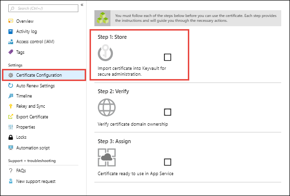

Key Vault is an Azure service that helps safeguard cryptographic keys and secrets used by cloud applications and services. It's the storage of choice for App Service certificates.

In the **Key Vault Status** page, click **Key Vault Repository** to create a new vault or choose an existing vault. If you choose to create a new vault, use the following table to help you configure the vault and click Create. Create the new Key Vault inside the same subscription and resource group as your App Service app.

| Setting | Description |
|-|-|
| Name | A unique name that consists for alphanumeric characters and dashes. |
| Resource group | As a recommendation, select the same resource group as your App Service certificate. |
| Location | Select the same location as your App Service app. |
| Pricing tier | For information, see [Azure Key Vault pricing details](https://azure.microsoft.com/pricing/details/key-vault/). |
| Access policies| Defines the applications and the allowed access to the vault resources. You can configure it later.|
| Virtual Network Access | Restrict vault access to certain Azure virtual networks. You can configure it later.) |

Once you've selected the vault, close the **Key Vault Repository** page. The **Step 1: Store** option should show a green check mark for success. Keep the page open for the next step.


### Verify domain ownership

From the same **Certificate Configuration** page you used in the last step, click **Step 2: Verify**.

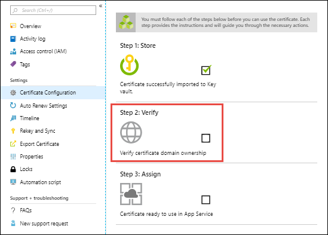

Select **App Service Verification**. Since you already mapped the domain to your web app (see [Prerequisites](#prerequisites)), it's already verified. Just click **Verify** to finish this step. Click the **Refresh** button until the message **Certificate is Domain Verified** appears.

> [!NOTE]
> Four types of domain verification methods are supported:
>
> - **App Service** - The most convenient option when the domain is already mapped to an App Service app in the same subscription. It takes advantage of the fact that the App Service app has already verified the domain ownership.
> - **Domain** - Verify an App Service domain that you purchased from Azure. Azure automatically adds the verification TXT record for you and completes the process.
> - **Mail** - Verify the domain by sending an email to the domain administrator. Instructions are provided when you select the option.
> - **Manual** - Verify the domain using either an HTML page (**Standard** certificate only) or a DNS TXT record. Instructions are provided when you select the option.


### Import certificate into App Service

In the <a href="https://portal.azure.com" target="_blank">Azure portal</a>, from the left menu, select **App Services** > **\<app-name>**.

From the left navigation of your app, select **TLS/SSL settings** > **Private Key Certificates (.pfx)** > **Import App Service Certificate**.

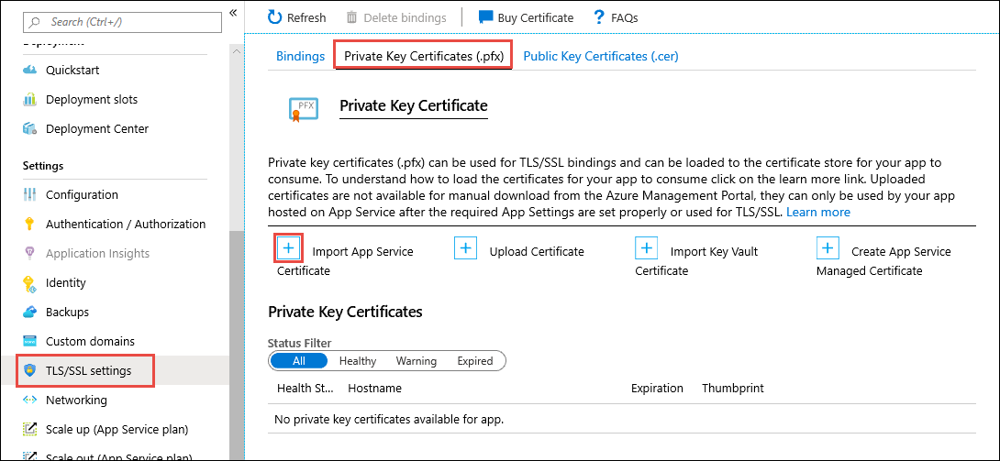

Select the certificate that you just purchased and select **OK**.

When the operation completes, you see the certificate in the **Private Key Certificates** list.

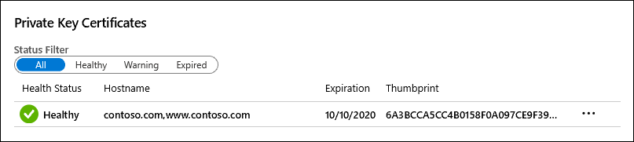

> [!IMPORTANT]
> To secure a custom domain with this certificate, you still need to create a certificate binding.
>


## Import a certificate from Key Vault

If you use Azure Key Vault to manage your certificates, you can import a PKCS12 certificate from Key Vault into App Service as long as it [satisfies the requirements](#private-certificate-requirements).

### Authorize App Service to read from the vault
By default, the App Service resource provider doesn’t have access to the Key Vault. In order to use a Key Vault for a certificate deployment, you need to authorize the resource provider read access to the KeyVault.

`abfa0a7c-a6b6-4736-8310-5855508787cd`  is the resource provider service principal name for App Service, and it's the same for all Azure subscriptions. For Azure Government cloud environment, use `6a02c803-dafd-4136-b4c3-5a6f318b4714` instead as the resource provider service principal name.

### Import a certificate from your vault to your app

In the <a href="https://portal.azure.com" target="_blank">Azure portal</a>, from the left menu, select **App Services** > **\<app-name>**.

From the left navigation of your app, select **TLS/SSL settings** > **Private Key Certificates (.pfx)** > **Import Key Vault Certificate**.

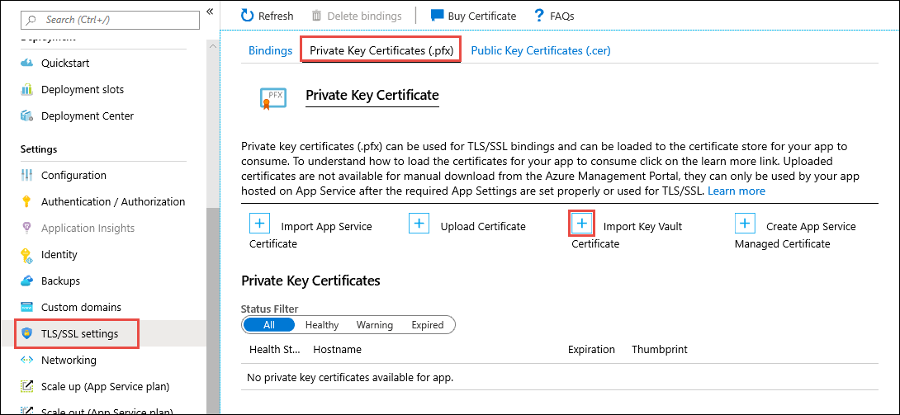

Use the following table to help you select the certificate.

| Setting | Description |
|-|-|
| Subscription | The subscription that the Key Vault belongs to. |
| Key Vault | The vault with the certificate you want to import. |
| Certificate | Select from the list of PKCS12 certificates in the vault. All PKCS12 certificates in the vault are listed with their thumbprints, but not all are supported in App Service. |

When the operation completes, you see the certificate in the **Private Key Certificates** list. If the import fails with an error, the certificate doesn't meet the [requirements for App Service](#private-certificate-requirements).


> [!NOTE]
> If you update your certificate in Key Vault with a new certificate, App Service automatically syncs your certificate within 48 hours.

> [!IMPORTANT]
> To secure a custom domain with this certificate, you still need to create a certificate binding.
>


## Upload a private certificate

Once you obtain a certificate from your certificate provider, follow the steps in this section to make it ready for App Service.

### Merge intermediate certificates

If your certificate authority gives you multiple certificates in the certificate chain, you need to merge the certificates in order.

To do this, open each certificate you received in a text editor.

Create a file for the merged certificate, called _mergedcertificate.crt_. In a text editor, copy the content of each certificate into this file. The order of your certificates should follow the order in the certificate chain, beginning with your certificate and ending with the root certificate. It looks like the following example:

```
-----BEGIN CERTIFICATE-----
<your entire Base64 encoded SSL certificate>
-----END CERTIFICATE-----

-----BEGIN CERTIFICATE-----
<The entire Base64 encoded intermediate certificate 1>
-----END CERTIFICATE-----

-----BEGIN CERTIFICATE-----
<The entire Base64 encoded intermediate certificate 2>
-----END CERTIFICATE-----

-----BEGIN CERTIFICATE-----
<The entire Base64 encoded root certificate>
-----END CERTIFICATE-----
```

### Export certificate to PFX

Export your merged TLS/SSL certificate with the private key that your certificate request was generated with.

If you generated your certificate request using OpenSSL, then you have created a private key file. To export your certificate to PFX, run the following command. Replace the placeholders _&lt;private-key-file>_ and _&lt;merged-certificate-file>_ with the paths to your private key and your merged certificate file.

```bash
openssl pkcs12 -export -out myserver.pfx -inkey <private-key-file> -in <merged-certificate-file>
```

When prompted, define an export password. You'll use this password when uploading your TLS/SSL certificate to App Service later.

If you used IIS or _Certreq.exe_ to generate your certificate request, install the certificate to your local machine, and then export the certificate to PFX.

### Upload certificate to App Service

You're now ready upload the certificate to App Service.

In the <a href="https://portal.azure.com" target="_blank">Azure portal</a>, from the left menu, select **App Services** > **\<app-name>**.

From the left navigation of your app, select **TLS/SSL settings** > **Private Key Certificates (.pfx)** > **Upload Certificate**.


In **PFX Certificate File**, select your PFX file. In **Certificate password**, type the password that you created when you exported the PFX file. When finished, click **Upload**.

When the operation completes, you see the certificate in the **Private Key Certificates** list.


> [!IMPORTANT]
> To secure a custom domain with this certificate, you still need to create a certificate binding.
>


# Todo List

- Finish the sample code using some service connection (like storage account).


# Work Progress

90%
